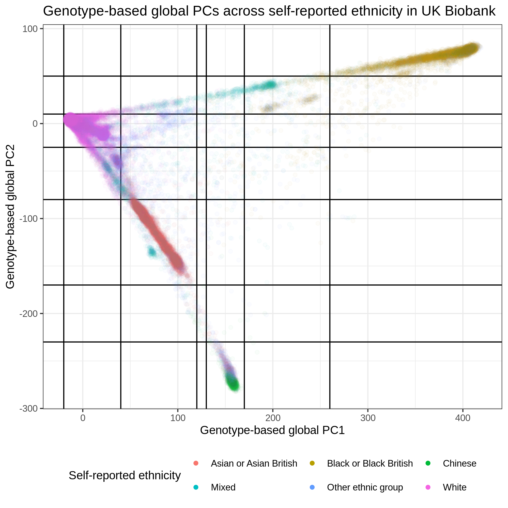
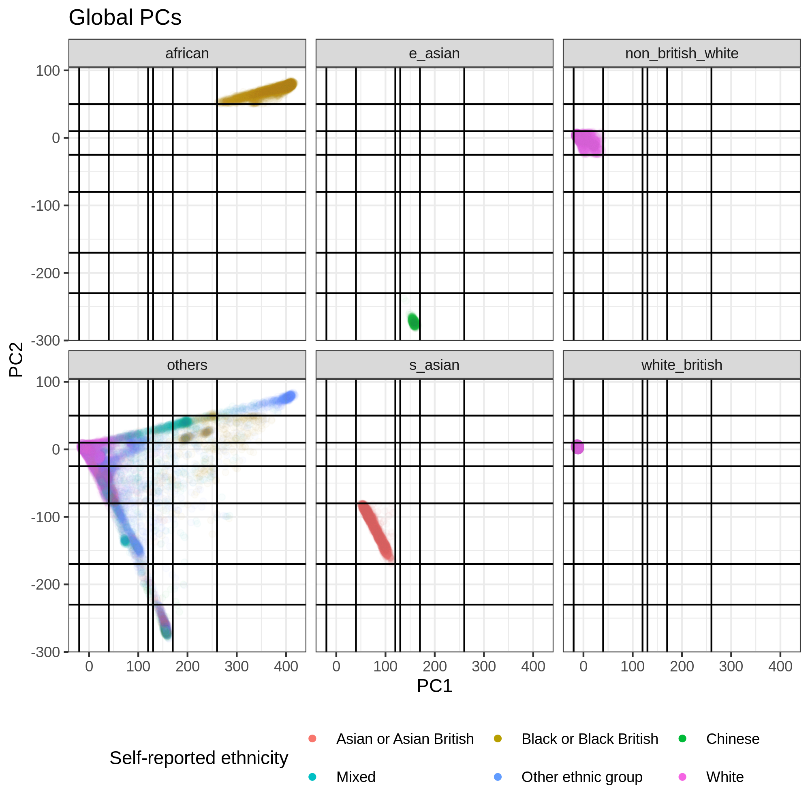
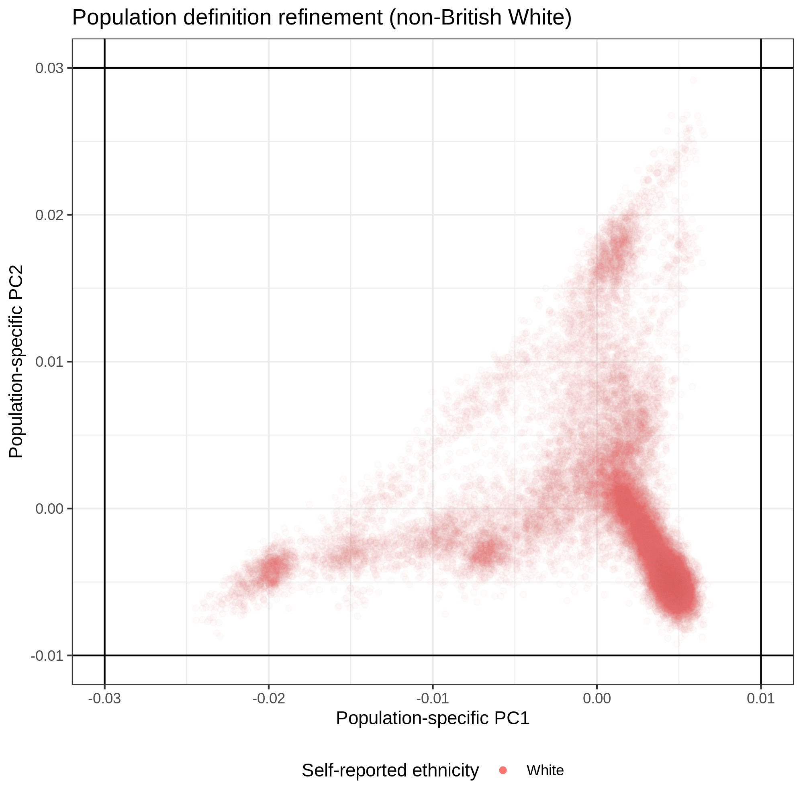
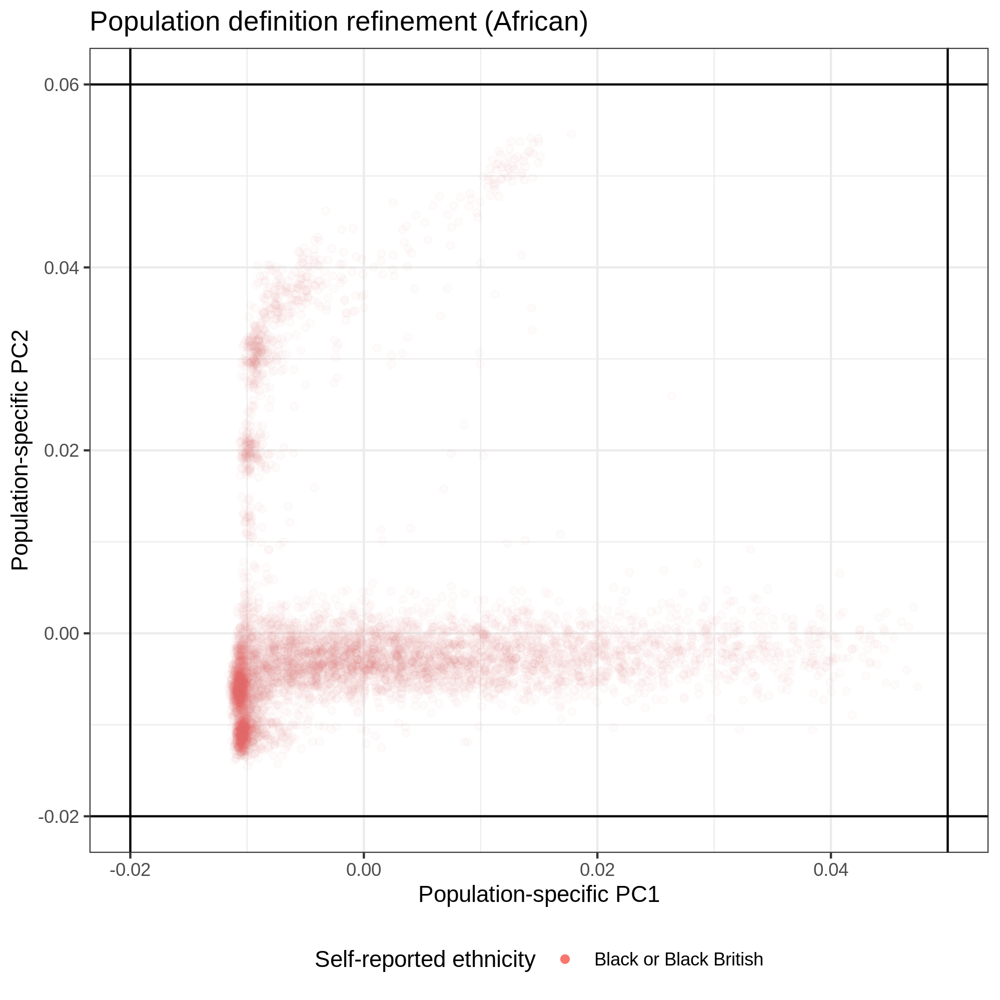
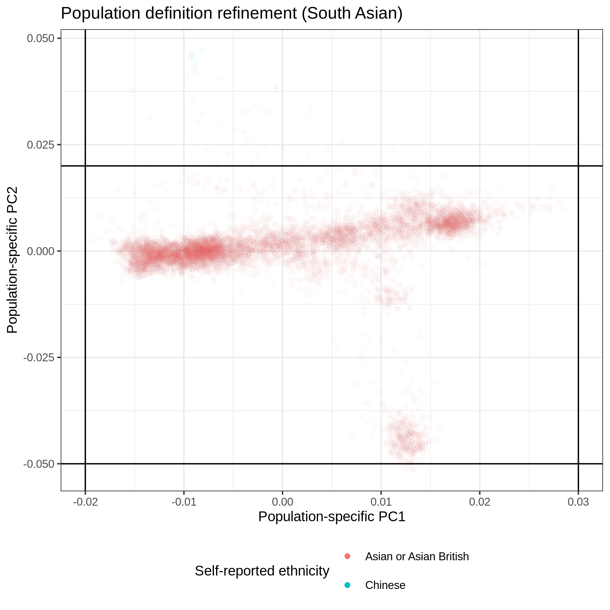
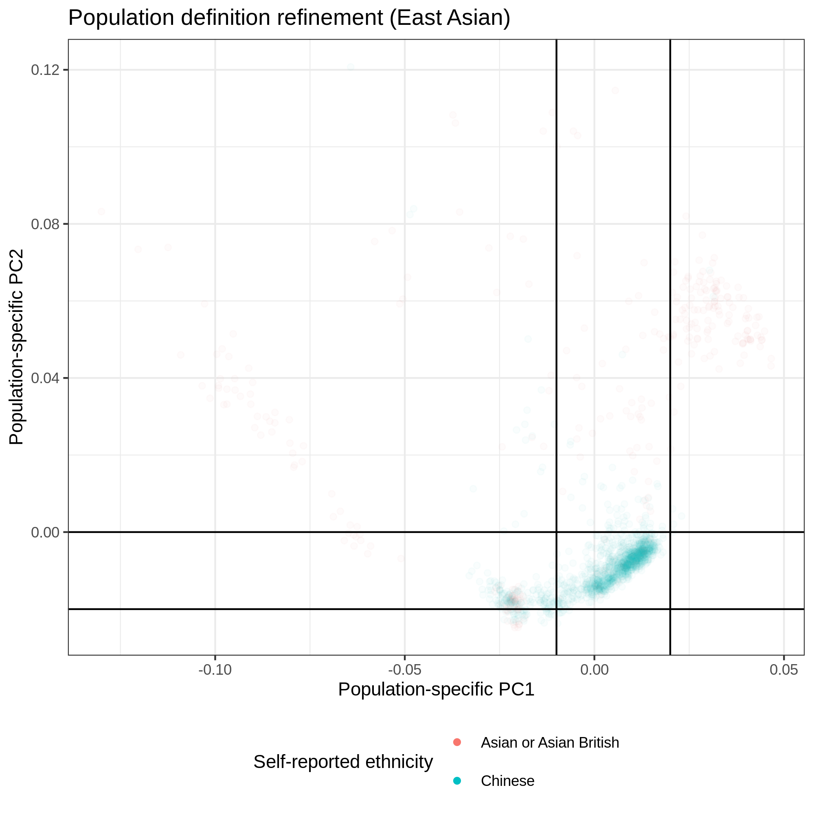
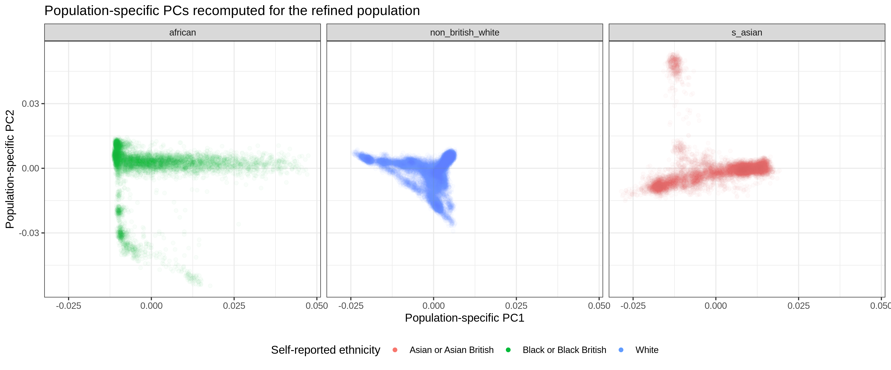

# Filtering

We do not employ sample- and variant-level QC in the traditional sense in this pipeline. Sample-level QC is often done by the BioBank itself before the data is sent out, and variant-level QC is done after GWAS is run (in case any signal can be recovered despite bad data).

The notebooks in this folder do two distinct tasks:

1) [Go over the overall marker quality of different BioBank arrays](https://github.com/rivas-lab/ukbb-tools/blob/master/03_filtering/Marker_QC.ipynb) (marker_QC.ipynb)
2) [sample-level QC, define populations, and generate the GWAS covariate file](https://github.com/rivas-lab/ukbb-tools/blob/master/03_filtering/sample_qc_v3.2.ipynb) (rsample_qc_v3.2.ipynb)

## Variant-level QC

We document variant annotation in [17_annotation](/17_annotation) directory.

### array dataset

The variant QC procedure for the genotyped array dataset is well described in the publications from the lab.

1. [DeBoever, C. et al. Medical relevance of protein-truncating variants across 337,205 individuals in the UK Biobank study. Nature Communications 9, 1612 (2018).](https://doi.org/10.1038/s41467-018-03910-9)
2. [Tanigawa, Y. et al. Components of genetic associations across 2,138 phenotypes in the UK Biobank highlight adipocyte biology. Nat Commun 10, 1–14 (2019).](https://doi.org/10.1038/s41467-019-11953-9)

The second paper has the variant QC flowchart as Supplementary Figure 1.

### phased array dataset

Please check [`hap`](hap) directory for more information. As of 3/27/2020, we are asking some issues in BGEN files to UK Biobank.

### imputation dataset

We have [`imp`](imp) directory to document the QC and filtering procedure for the imputation dataset. Specifically, [`imp/2_var_QC`](imp/2_var_QC) has the variant QC procedure.

## Sample-level QC

### version history

- `population_stratification_w24983_20200313`: this one corresponds to `sample_qc_v3.2`. The difference between v3.1 and v3.2 are the participant Withdrawal information. We also improved the clarity of the documentation.

### Participant Withdrawal

The latest set of individuals who withdrew their participation to UK Biobank is recorded in the following file:

`/oak/stanford/groups/mrivas/ukbb24983/sqc/W24983_20200204.csv`

This file is a superset of the previous versions of the withdrawal files.

#### Previous versions of withdrawal files

So far, we received the following 3 files.

- `w24983_20200204.csv` (117 individuals)
- `w24983_20181016.csv` (79 individuals)
- `w2498_20170726.csv` (3 individuals)

```{bash}
$ cd /oak/stanford/groups/mrivas/ukbb24983/sqc
$ comm -13 <( sort w24983_20200204.csv ) <( sort w24983_20181016.csv ) | wc -l
0
$ comm -13 <( sort w24983_20181016.csv ) <( sort w2498_20170726.csv ) | wc -l
0
```

### Population definition

Please see [sample_qc_v3.2.ipynb](sample_qc_v3.2.ipynb) for more details.

We also have additional population definition based on the self-reported ethnicity data. Please see [sample_qc_v3.2.self_reported_pop_def.ipynb](sample_qc_v3.2.self_reported_pop_def.ipynb) for more details.

- Chinese (`N = 1419`)
- Indian (`N = 5117`)
- Pakistani (`N = 1583`)
- Bangladeshi (`N = 209`)

#### summary of the definition of the 5 population groups

We used a combination of PCA (on array genotype data) and self-reported ancestry to define the following five population groups:

- White British (`ukb24983_white_british.phe`, N = 337,138)
- Non-British White (`ukb24983_non_british_white.phe`, N = 24,905)
- South Asian (`ukb24983_s_asian.phe`, N = 7,885)
- African (`ukb24983_african.phe`, N = 6,497)
- East Asian (`ukb24983_e_asian.phe`, N = 1,154)

In total, we have 378,292 unrelated individuals

- Those files are available: `/oak/stanford/groups/mrivas/ukbb24983/sqc/population_stratification_w24983_20200313`
- In the directory, we have the following files:
  - `ukb24983_<population>.phe`: the list of individuals in the population.
  - `ukb24983_<population>.exclude.phe`: the list of individuals that are not in the population.
  - `ukb24983_GWAS_covar.20200313.phe`: GWAS covariate file
  - `ukb24983_master_sqc.20200313.phe`: the all sample QC columns and potentially interesting covariates. The GWAS covariate file is a subset of this file.
  
Additionally, we will include more individuals by including individuals who are not part of our population groupings.

- [`sample_qc_v3.2.1_pop_count.ipynb`](sample_qc_v3.2.1_pop_count.ipynb)
- 28,551 (no assignment) + 618 (East Asian outlier) + 77 (South Asian outlier)

##### Self-reported ethnicity



##### Our population definition



#### sample-level QC criteria

Our filtering criteria are as follows:

- Not present in the "remove file" (`! in_remove_file`, see 'Participant Withdrawal' section above)
- `FID >= 0`
- `IID >= 0`
- `putative_sex_chromosome_aneuploidy == 0`
- `het_missing_outliers == 0`
- `excess_relatives == 0`
- `used_in_pca_calculation == 1`

#### Genotype PC-based population definition

We defined the following thresholds to define ethnic groups

- White British
  - `-20 <= PC1 <= 40 && -25 <= PC2 <= 10` (Global PCs provided by UK Biobank)
  - `in_white_British_ancestry_subset == 1` (in sample QC file)
- Non-British White
  - `-20 <= PC1 <= 40 && -25 <= PC2 <= 10`
  - Based on self-reported ancestry (UKB field 21000), the individual is White, but is not White British.
- African
  - `260 <= PC1        &&   50 <= PC2` (Global PCs provided by UK Biobank)
  - Based on self-reported ancestry (UKB field 21000), the individual is White, but is not any of the followings: White, Asian, Mixed, and Other Ethnic Groups
- South Asian
  - `40 <= PC1 <= 120 && -170 <= PC2 <= -80` (Global PCs provided by UK Biobank)
  - Based on self-reported ancestry (UKB field 21000), the individual is White, but is not any of the followings: White, Black, Mixed, and Other Ethnic Groups
  - We subsequently applied thresholds on local PCs (the ones re-computed for the initially assigned population group)
  - `0.02 <= PC1 <= 0.03 && -0.05 <= PC2 <= 0.02`
- East Asian
  - `130 <= PC1 <= 170 &&         PC2 <= -230` (Global PCs provided by UK Biobank)
  - Based on self-reported ancestry (UKB field 21000), the individual is White, but is not any of the followings: White, Black, Mixed, and Other Ethnic Groups
  - We subsequently applied thresholds on local PCs (the ones re-computed for the initially assigned population group)
  - `-0.01 <= PC1 <= 0.02 && -0.02 <= PC2 <= 0`

See more details in notebook for v3.1 ([`sample_qc_v3.1.ipynb`](sample_qc_v3.1.ipynb)).

#### Additional clean-up using population specific PCs

We applied PCA for 4 populations (all, but White British) and characterized population-specific PCs ([`sample_qc_v3.PCA.sh`](sample_qc_v3.PCA.sh)). We performed the manual inspections and removed outliers (written as population refinement in the notebook, [`sample_qc_v3.2.ipynb`](sample_qc_v3.2.ipynb)) based on the population-specific PC1 and PC2.

- South Asian: `-0.02 <= PC1 <= 0.03`, `-0.05 <= PC2 <= 0.02` (n = 7962 -> 7885)
- East Asian: `-0.01 <= PC1 <= 0.02`, `-0.02 <= PC2 <= 0` (n = 1772 -> 1154)

Note that African and Non-British White populations are not affected.

##### Non-British White



##### African



##### South Asian



##### East Asian



#### Re-computing the population-specific PCs

We compute the population-specific PCs (one more time) using the two refined populations (East and South Asians).



Our population specific PCs are:

- `White British`: exactly the same as the global PCs provided by UK Biobank.
- `Non-British white`: the local PCs computed for NBW ([`sample_qc_v3.PCA.sh`](sample_qc_v3.PCA.sh)).
- `African`: the local PCs computed for African ([`sample_qc_v3.PCA.sh`](sample_qc_v3.PCA.sh)).
- `East Asian`: the local PCs computed for East Asian ([`sample_qc_v3.PCA.sh`](sample_qc_v3.PCA.sh)). Note that we recomputed the local PCs after the population refinement (outlier removal).
- `South Asian`: the local PCs computed for South Asian ([`sample_qc_v3.PCA.sh`](sample_qc_v3.PCA.sh)). Note that we recomputed the local PCs after the population refinement (outlier removal).

#### GWAS covariate file

In the GWAS covariate file, we included the followings:

- FID and IID: the family and individual ID
- population: the final population definition
- split: train/val/test (70%, 20%, and 10% for each) split for the White British cohort. We used the one from the DeGAs-risk project.
- age: (computed as 2017 - birth year)
- age0, age1, age2 and age3: the age of the assessment center visits
- sex: 1 indicates male; 0 indicates female
- BMI: The BMI phenotype (from `INI21001.phe` in basket 9796 and table 24611)
- N_CNV and LEN_CNV: the number and length of CNVs.
- Array: 1 indicates UKBB array; 0 indicates UKBL array.
- PC1-PC40: the population-specific PCs for 4 populations (Non-British White, African, South Asian, and East Asian) and the global PCs for White British
- Global_PC1-Global_PC40: the Global PCs provided by UK Biobank

#### Lists of individuals and variants on Axiom and BiLEVE Arrays

```{bash}
999  awk '($144==1){print $1,$2}' /oak/stanford/groups/mrivas/ukbb24983/sqc/population_stratification_w24983_20200313/ukb24983_master_sqc.20200313.phe > /oak/stanford/groups/mrivas/ukbb24983/sqc/axiom_individuals.txt

1000  awk '($144==0){print $1,$2}' /oak/stanford/groups/mrivas/ukbb24983/sqc/population_stratification_w24983_20200313/ukb24983_master_sqc.20200313.phe > /oak/stanford/groups/mrivas/ukbb24983/sqc/bileve_individuals.txt

 [magu@sh02-ln02 login /oak/stanford/groups/mrivas/private_data/ukbb/variant_filtering]$ zcat variant_filter_table.tsv.gz | awk '($21 ~ /T/){print $5}' > /oak/stanford/groups/mrivas/ukbb24983/sqc/axiom_specific_variants.txt

[magu@sh02-ln02 login /oak/stanford/groups/mrivas/private_data/ukbb/variant_filtering]$ zcat variant_filter_table.tsv.gz | awk '($22 ~ /T/){print $5}' > /oak/stanford/groups/mrivas/ukbb24983/sqc/bileve_specific_variants.txt

 ```
