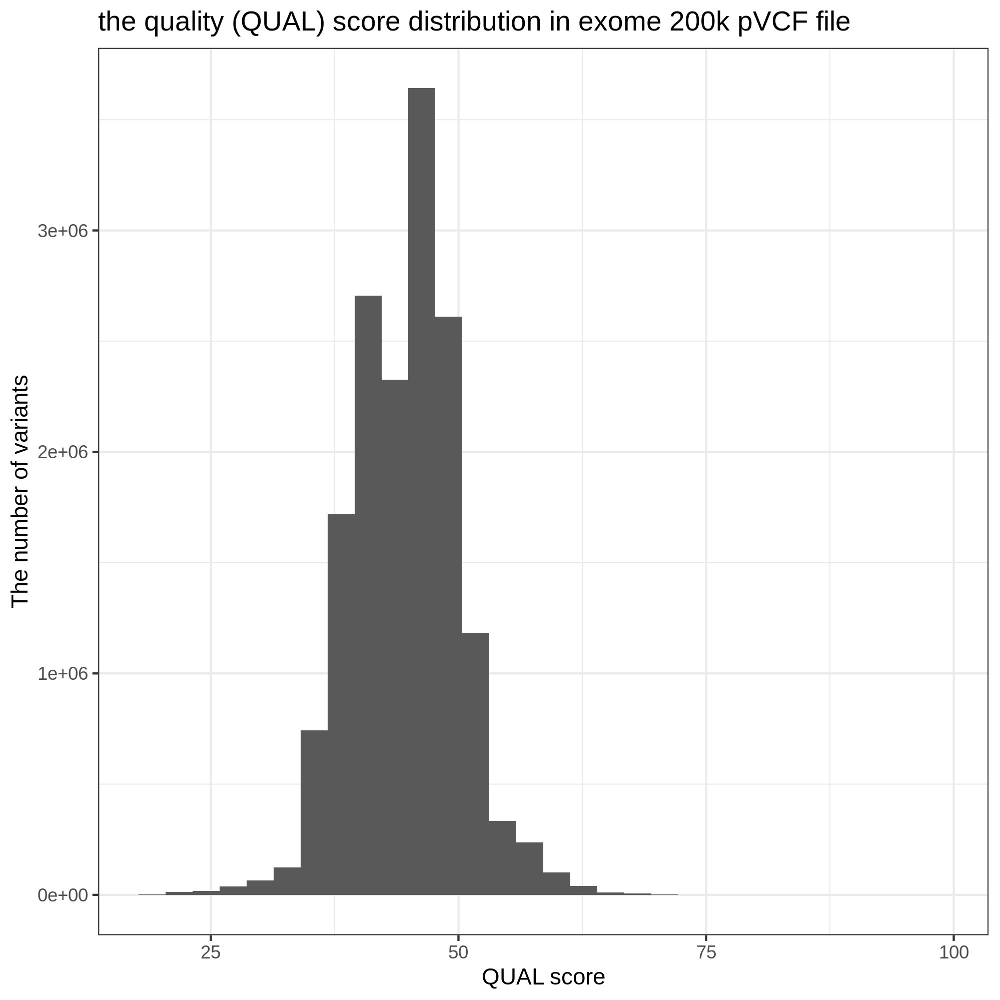
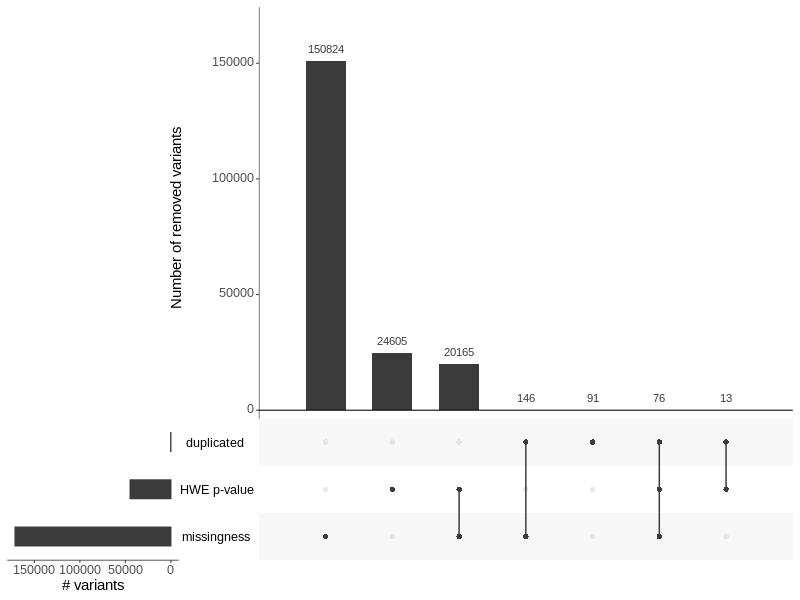

# The exome 200k dataset

Yosuke Tanigawa, 2020/10/26

## file location

`/oak/stanford/groups/mrivas/ukbb24983/exome/pgen/oqfe_2020`

- `download`: (symlink to `/scratch`)
- `ukb24983_exomeOQFE.{pgen,pvar.zst,psam}`

## Related contents

- [Variant annotation](/17_annotation/20201025_exome_oqfe_2020)
- [GWAS analysis](/04_gwas/extras/20201026_exome_gwas_parallel)

## QC

The list of QC-passed variants are in `/oak/stanford/groups/mrivas/ukbb24983/exome/qc/oqfe_2020/ukb24983_exomeOQFE.passQC.20201222.tsv.gz`.

Starting version `20210108`, the results of our QC is also included in our variant annotation file. Please read [here](/17_annotation/20201025_exome_oqfe_2020) for more information.

### (cf.) QC criteria in Szustakowski et al 2020

- [Szustakowski et al 2020](https://doi.org/10.1101/2020.11.02.20222232)
  - individual and variant missingness <10%
  - Hardy Weinberg Equilibrium p-value>10^-15
  - minimum read coverage depth of 7 for SNPs and 10 for indels
  - at least one sample per site passed the allele balance threshold > 0.15 for SNPs and 0.20 for indels.

### duplicate detection in exome 200k

In the exome 200k dataset in UK Biobank, we find 163 pairs (326 variant IDs) of "duplicated" variants. Each pair represents the exact same variant, if you take `uniq` on (CHROM, POS, REF, ALT) tupple, but they are stored as different variants.

The list of duplicated variants are stored in `/oak/stanford/groups/mrivas/ukbb24983/exome/qc/oqfe_2020/intermediate_files/ukb24983_exomeOQFE.duplicates.tsv.gz`.

Please see the following two analysis scripts/notebook for more info.

- [`20201217_duplicated_variants_step1.sh`](20201217_duplicated_variants_step1.sh)
- [`20201217_duplicated_variants_step2.ipynb`](20201217_duplicated_variants_step2.ipynb)

### per-variant missingness and HWE

We performed variant annotation using [VEP](/17_annotation/20201025_exome_oqfe_2020).

### pVCF file

We downloeded the [Population level exome OQFE variants, pVCF format (UKB Data-Field 23156)](https://biobank.ctsu.ox.ac.uk/crystal/field.cgi?id=23156). The pVCF files have more detailed information including the variant calling quality and was used as a source file of the genotype dataset stored in the PLINK 1.9 file format. Because of the file size, the data is stored in 977 blocks (each block contains a continous genomic region).

Example of the pVCF file header is extracted to [`pvcf.header.txt`](pvcf.header.txt).

For example, there is a flag in the `FILTER` column.

> ##FILTER=<ID=MONOALLELIC,Description="Site represents one ALT allele in a region with multiple variants that could not be unified into non-overlapping multi-allelic sites">

There are 114,728 variants annotated with this flag.

| FILTER      | n        |
|-------------|----------|
| .           | 15807976 |
| MONOALLELIC |   114728 |



**Fig. The distribution of QUAL score in pVCF file.** Here we show the distribution of the QUAL score in the pVCF file.

Note that the number of lines does not match with what we have in the plink genotype file. This is likely because some multi-allelic sites are represented in one line in pVCF file.

We extracted the variant-level information to `/oak/stanford/groups/mrivas/ukbb24983/exome/qc/oqfe_2020/intermediate_files/ukb23156_pvcf_info.tsv.gz`.

### variant-level QC criteria

#### version 2020/12/22

`/oak/stanford/groups/mrivas/ukbb24983/exome/qc/oqfe_2020/ukb24983_exomeOQFE.passQC.20201222.tsv.gz`

The variants passed the following criteria are included: variant-level missingness < 10%, the Hardy-Weinberg equilibrium test (computed within unrelated individuals of white Brisith ancestry) p-value > 10^-15, and the variant is uniqly represented (the CHROM-POS-REF-ALT tupple is uniqly identified) in the PLINK dataset file.



**Fig. Summary of variant QC (version 2020/12/22).** In total, we removed 195,920 variants that does not meet any of the following criteria: variant-level missingness < 10% ("missingness"), the Hardy-Weinberg equilibrium test (computed within unrelated individuals of white Brisith ancestry) p-value > 10^-15 ("HWE"), and the variant is uniqly represented (the CHROM-POS-REF-ALT tupple is uniqly identified) in the PLINK dataset file ("duplicated").

##### additional notes, 2020/1/8

We checked the overlap of QC-passed variants with the "MONOALLELIC" filter in pVCF file.
It turned out that those variants marked as "MONOALLELIC" in pVCF file was not included in the genotype dataset.


## penalty factor for snpnet

### version 1, Yosuke Tanigawa, 2021/1/8

Focusing on the 17582030 variants that passed the QC criteria, we assigned the 3-level penalty factor.

- p.factor assignment rule
  - PTVs or ClinVar pathogenic --> 0.5
  - PAVs or ClinVar Likely pathogenic --> 0.75
  - Others --> 1.0

Here is the breakdown of the number of variants.

| w     | CLIN_SIG_curated     | Csq    | n       |
|-------|----------------------|--------|--------:|
| 0.50  | 1_pathogenic         | intron |      50 |
| 0.50  | 1_pathogenic         | others |      14 |
| 0.50  | 1_pathogenic         | pav    |    4640 |
| 0.50  | 1_pathogenic         | pcv    |      27 |
| 0.50  | 1_pathogenic         | ptv    |    5351 |
| 0.50  | 1_pathogenic         | utr    |      20 |
| 0.50  | 2_likely_pathogenic  | ptv    |    3326 |
| 0.50  | 3_no_pathogenic_info | ptv    |  484663 |
| 0.75  | 2_likely_pathogenic  | intron |      34 |
| 0.75  | 2_likely_pathogenic  | others |      11 |
| 0.75  | 2_likely_pathogenic  | pav    |    4541 |
| 0.75  | 2_likely_pathogenic  | pcv    |      35 |
| 0.75  | 2_likely_pathogenic  | utr    |      10 |
| 0.75  | 3_no_pathogenic_info | pav    | 5380877 |
| 1.00  | 3_no_pathogenic_info | intron | 6564947 |
| 1.00  | 3_no_pathogenic_info | others | 1163504 |
| 1.00  | 3_no_pathogenic_info | pcv    | 2188587 |
| 1.00  | 3_no_pathogenic_info | utr    | 1781393 |

where, 

- `w` is the assigned penalty factor (the variants with lower value will be prioritized)
- `CLIN_SIG_curated` is the summary of ClinGen annotation
- `Csq`: is the summary of the predicted consequence from VEP.
- `n`: is the number of variants


## methods summary

- [`1_download.sh`](1_download.sh): wrapper script for `gfetch`, submitted with [`1_download.sbatch.sh`](1_download.sbatch.sh)
- [`2_merge.sh`](2_merge.sh): we combine the per-chromosome genotype files into one file.
- We detect the set of "duplicated" variants
  - [`20201217_duplicated_variants_step1.sh`](20201217_duplicated_variants_step1.sh)
  - [`20201217_duplicated_variants_step2.ipynb`](20201217_duplicated_variants_step2.ipynb)
- We have a set of scripts to download and query the pVCF files:
  - [`3a_pvcf_download.sh`](3a_pvcf_download.sh)
  - [`3b_pvcf2pvar.sh`](3b_pvcf2pvar.sh)
  - [`3c_combine_info.sh`](3c_combine_info.sh)
  - [`3d_pvcf_header.sh`](3d_pvcf_header.sh)
  - [`3e_browse_pvcf_qual_fields.ipynb`](3e_browse_pvcf_qual_fields.ipynb)
- [`4_variant_QC.ipynb`](4_variant_QC.ipynb): generate the UpSetR plot summarizing our QC procedure and generate the list of QC-passed variants.

### preparing the bim file

```
wget -nd  biobank.ctsu.ox.ac.uk/crystal/crystal/auxdata/UKBexomeOQFEbim.zip
```

### `gfetch` software

```
wget -nd  biobank.ctsu.ox.ac.uk/showcase/util/gfetch
chmor 770 gfetch
```
