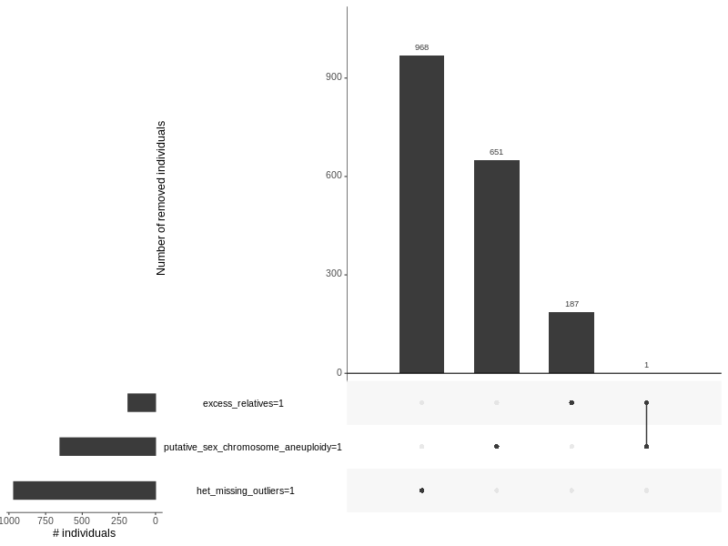

# population stratification version 2020/8/28

## Yosuke Tanigawa

We defined the following 7 populations. This final population assignment is recorded in the `population` column in the GWAS covariate file and the master phe file (see "file location" section below).

| population        | UKBB   | UKBL  | w_exome | wo_exome | n      |
|-------------------|--------|-------|---------|----------|--------|
| white_british     | 300094 | 37035 | 34392   | 302737   | 337129 |
| related           |  39873 |  4759 |  4297   |  40335   |  44632 |
| others            |  26594 |  2062 |  3113   |  25543   |  28656 |
| non_british_white |  22406 |  2499 |  2694   |  22211   |  24905 |
| s_asian           |   7831 |     0 |   876   |   6955   |   7831 |
| african           |   6497 |     0 |   847   |   5650   |   6497 |
| e_asian           |   1704 |     0 |   181   |   1523   |   1704 |
| DO_NOT_PASS_SQC   |   1805 |   126 |   197   |   1734   |   1931 |

Note: `DO_NOT_PASS_SQC` is assigned as a "population" label to flag the set of individuals that do NOT pass our sample-level QC.

## File locations

- The data directory: `/oak/stanford/groups/mrivas/ukbb24983/sqc/population_stratification_w24983_20200828/`
- master_sqc_file: `ukb24983_master_sqc.20200828.phe`
- GWAS_covar_file: `ukb24983_GWAS_covar.20200828.phe`

### GWAS covariate file

In the GWAS covariate file, we included the followings:

- FID and IID: the family and individual ID
- population: the final population definition
- split: train/val/test (70%, 20%, and 10% for each) split for the White British cohort. We used the one from the DeGAs-risk project.
- age: (computed as 2017 - birth year)
- age0, age1, age2 and age3: the age of the assessment center visits
- sex: 1 indicates male; 0 indicates female
- BMI: The BMI phenotype (from `INI21001.phe` in basket 9796 and table 24611)
- N_CNV and LEN_CNV: the number and length of CNVs.
- Array: 1 indicates UKBB array; 0 indicates UKBL array.
- PC1-PC40: the population-specific PCs for 4 populations (Non-British White, African, South Asian, and East Asian) and the global PCs for White British
- Global_PC1-Global_PC40: the Global PCs provided by UK Biobank

## Update summary

- 2020/8/28: update to the most recent remove file; redefine s_asian and e_asian; update local PCs
- 2020/5/11: we update the PCA plots
- 2020/3/13: this version was used in [GWAS freeze 202007](/04_gwas/check_gwas/202007)

## Methods

### sample-level QC (`sqc`) criteria

Our filtering criteria are as follows:

- Not present in the "remove file". 
  - `/oak/stanford/groups/mrivas/ukbb24983/sqc/w24983_20200820.csv` was used in this version.
- `FID >= 0` and `IID >= 0`
- `putative_sex_chromosome_aneuploidy == 0`
- `het_missing_outliers == 0`
- `excess_relatives == 0`

For the set of individuals who do NOT pass this sample-level QC were flagged as `DO_NOT_PASS_SQC`.

### Definition of the 7 populations

- White British (`white_british`)
  - `used_in_pca_calculation == 1` (in sample QC file)
  - `-20 <= Global_PC1 <= 40 && -25 <= Global_PC1 <= 10`
  - `in_white_British_ancestry_subset == 1` (in sample QC file)
- Non-British White (`non_british_white`)
  - `used_in_pca_calculation == 1` (in sample QC file)
  - `-20 <= Global_PC1 <= 40 && -25 <= Global_PC2 <= 10`
  - Based on self-reported ancestry (UKB field 21000), the individual is White, but is not White British.
- African (`african`)
  - `used_in_pca_calculation == 1` (in sample QC file)
  - `260 <= Global_PC1       &&  50 <= Global_PC2`
  - Based on self-reported ancestry (UKB field 21000), the individual is Black, but is not any of the followings: White, Asian, Mixed, and Other Ethnic Groups
- South Asian (`s_asian`)
  - `used_in_pca_calculation == 1` (in sample QC file)
  - `40 <= Global_PC1 <= 120 && -170 <= Global_PC2 <= -80`
  - Based on self-reported ancestry (UKB field 21000), the individual is Asian, but is not any of the followings: White, Black, Mixed, and Other Ethnic Groups
  - We subsequently applied thresholds on local PCs: `PC2 <= 0.02`
- East Asian (`e_asian`)
  - `used_in_pca_calculation == 1` (in sample QC file)
  - `130 <= PC1 <= 170 &&         PC2 <= -230`
  - Based on self-reported ancestry (UKB field 21000), the individual is Asian, but is not any of the followings: White, Black, Mixed, and Other Ethnic Groups
  - For East Asian dataset, we applied `smartpca` implemented in EIG suite. Some individuals were removed during its built-in outlier removal procedure.
- Semi-related (`related`)
  - We took the set of [semi-related individuals](/03_filtering/relatedness_20200514)
  - We checked those individuals were note removed by the 
- Others (`others`)
  - `used_in_pca_calculation == 1` (in sample QC file)
  - All the QC-passed & non-related individuals who were not assigned in any of the population listed above.

### `training`, `validation`, and `test` set definition

We brrowed the training (70%), validation (10%), and test (20%) set split from DeGAs-PRS (dPRS) project.

This split is defined for White British cohort only. Starting this version, we copied the "population" assignment for other populations into the "split" column.

### List of scripts in this directory

- [`0_file_names.R`](0_file_names.R): configure the file names of the data files
- [`1_initial_assignment.ipynb`](1_initial_assignment.ipynb): using QC flags in `sqc` file and other information, we apply initial population assignment based on Global PCs and self-reported ancestry.
- [`2_pca1_refinement.sh`](2_pca1_refinement.sh): we apply PCA analysis to compute the population-specific PCs for the following populations.
  - `white_british`
  - `non_british_white`
  - `african`
  - `s_asian`
  - `e_asian`: we used EIG's `smartpca` for `e_asian`.
- [`3_population_refinement.ipynb`](3_population_refinement.ipynb): For South Asian individuals, we further removed outliers based on thresholds on population-specific PCs.
- [`4_pca2_covars.sh`](4_pca2_covars.sh): we recompute the population-specific PCs for South Asian population.
- [`5_copy_pca_plots.sh`](5_copy_pca_plots.sh): we deposit the PCA plots (PC1 vs. PC2) in [`figs`](figs) directory.
- [`6_final_assignment.ipynb`](6_final_assignment.ipynb): we combine the results from the population-specific PC computation and finalize the population assignment. We then generate the master sqc file as well as GWAS covariate file.
- [`7_update_master_phe.R`](7_update_master_phe.R): we also incorporate the results into the master phe file.
