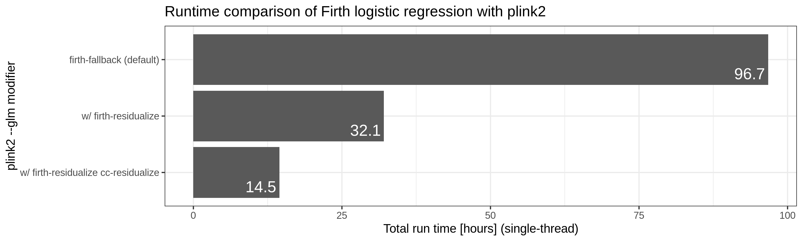
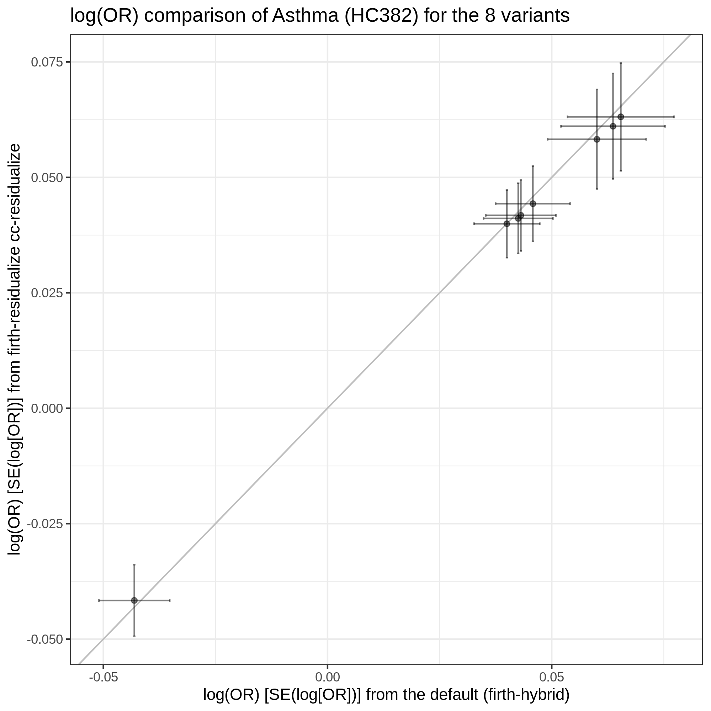
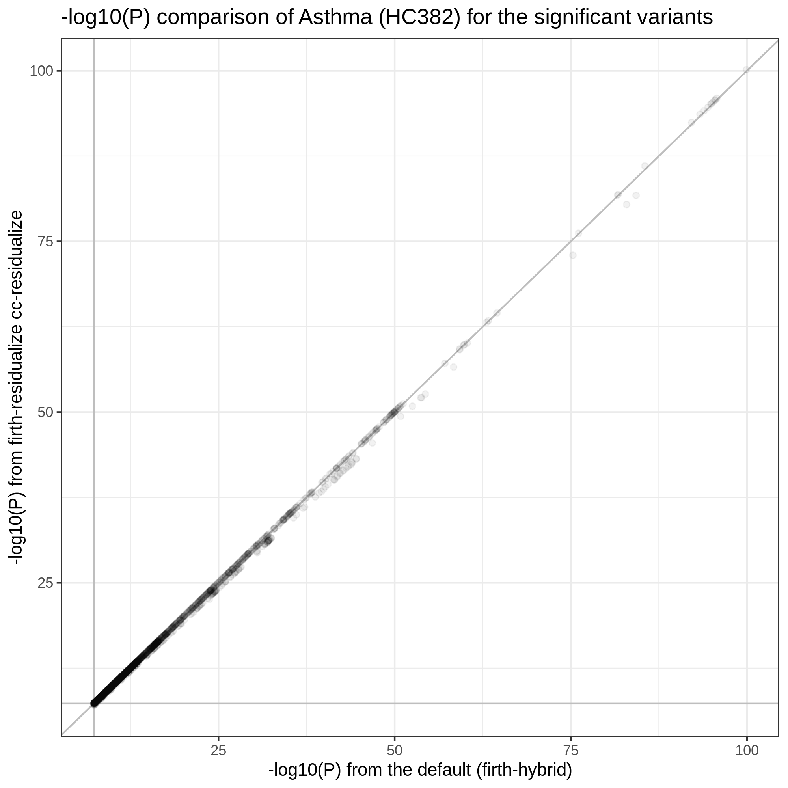
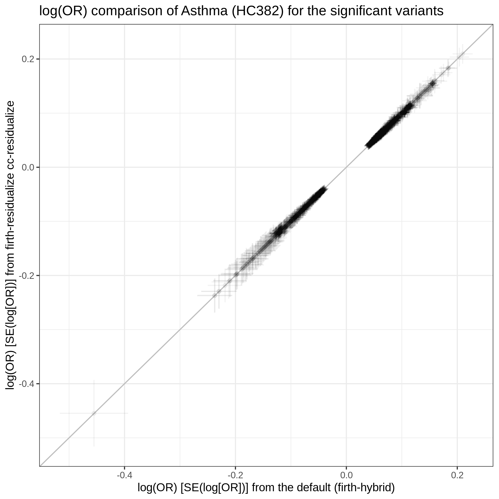

# plink2 --glm firth-residualize option benchmark

Yosuke Tanigawa

2020/7/25

We have GWAS script (in parallel job mode) and we test the `--glm firth-residualize cc-residualize` options.

## scripts

- [`plink.gwas.sh`](plink.gwas.sh): this is a draft of new GWAS script. It computes GWAS of a trait in 100 array job tasks, each of them uses only 2 CPU cores and 7GB of mem. With this light resource req, we expect to see much smoother schedulig of the tasks on the SLURM scheduler on Sherlock.
  - In fact, the array GWAS finished within 70 min with this array-job script.
    - Job submission/start: 2020/8/9 18:15
    - Job finish: 2020/8/9 19:21
- [`gwas_parallel_combine.sh`](gwas_parallel_combine.sh): this script merges the resulting GWAS summary statistics
- [`plink2_runtime_seconds.py`](plink2_runtime_seconds.py): this Python script parses the PLINK log file and report the run-time in seconds. The input file can be a concatenation of multiple PLINK log files. In that case, this script returns the sum of the run-times. This multi-input is a useful feature when analyzing the run time of GWAS perofrmed as a series of array job.

## results

### run-time comparison



*Figure.* Run-time comparison. Using Asthma (HC382) as an example trait,  we compared the run-time of the Firth logistic regression with `plink2` (version `20200727`). We applied `--glm` for the array-combined dataset of 1,080,968 variants. We used three different sets of modifiers for the `--glm` command:

- `--glm skip-invalid-pheno hide-covar omit-ref no-x-sex firth-fallback`
- `--glm skip-invalid-pheno hide-covar omit-ref no-x-sex firth-fallback firth-residualize`
- `--glm skip-invalid-pheno hide-covar omit-ref no-x-sex firth-fallback firth-residualize cc-residualize`

All the compuation was performed using a series of array jobs of 100 tasks, each of them used 2 CPU cores. The run-time was obtained from the PLINK log files, multiplied by 2 (to nomalize the number of CPU cores used in the compuation), and shown as the total computation time across the 100 tasks.

### Consistency of the results

We compared the results from the default setting and the one with `firth-residualize cc-residualize` modifiers.

We first compared the number of genome-wide significant (`p < 5e-8`) associations.

The default setting identified 1922 associations whereas the "residualized" run identified a subset of 1914 variants.

We then compared the BETAs of the 8 variants and found that the two estimates are mostly consistent.



*Figure.* The log(OR) comparison for the 8 variants that are significant in the default setting but not significant in the "residualized" regression. The default setting identified 1922 associations whereas the "residualized" run identified a subset of 1914 variants. The log(OR) of the 8 variants are shown in the plot. The error bars represent the standard errors.

We then compared the BETA and the -log10(P) for significant variants.




*Figure.* The -log10(P) comparison for 1922 variants that are significant either in the default setting or in the "residualized" regression.



*Figure.* The log(OR) comparison for 1922 variants that are significant either in the default setting or in the "residualized" regression. The error bars represent the standard errors.

Using a linear regression, we also confirmed that the p-values and BETAs are consistent without imposing the genome-wide significance filter.

Please see more details in the analysis notebook, [`comparison.ipynb`](comparison.ipynb).

## Technical notes

### data directory

`/oak/stanford/groups/mrivas/users/ytanigaw/sandbox/20200725-plink2-firth`

### job submission commands

```{bash}
sbatch -p mrivas,normal,owners --time=6:00:00 --mem=8000 --nodes=1 --cores=2 --job-name=firth --output=logs/firth.%A_%a.out --error=logs/firth.%A_%a.err --array=1-100 $parallel_sbatch_sh plink.gwas.sh 1.100.jobs 1

Submitted batch job 5539431
```
