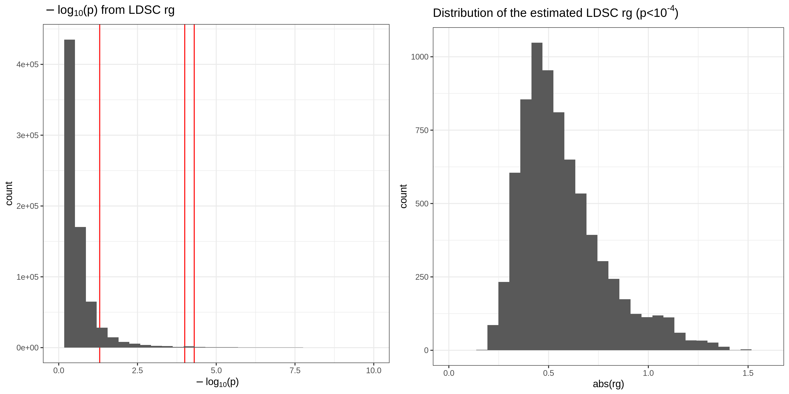

# FinnGen R3 public release

- Total sample size: ​135,638
- Total number of variants analyzed: 16,962,023 variants
- Number of disease endpoints (phenotypes) available: ​1,801 endpoints
- Public data release: June 16 2020
- https://www.finngen.fi/en/access_results

## files

- Data directory: `/scratch/groups/mrivas/public_data/summary_stats/finngen_r3`
- Summary statistics data files:
  - `summary_stats`: the original sumstats from FinnGen R3 (on hg38)
  - `summary_stats_hg19`: the sumstats on hg19
  - `summary_stats_hg19_plink`: the sumstats on hg19 in plink format.
  - `summary_stats_hg19_ldsc_munge`: the summary statistics on hg19 in LDSC munge format.
- List of variants
  - `finngen_r3_variants.tsv.gz`: list of variants (hg38)
  - `finngen_r3_variants.hg19.unmapped.gz`: list of variants that are not mapped to hg19 using our liftOver scirpt
  - `finngen_r3_variants.hg19.fasta.tsv.gz`: list of vairnats on hg19 with the REF character from the FASTA file
  - `finngen_r3_variants.master.tsv.gz`: "master bim" file.

## scripts

- [`1_download.sh`](1_download.sh): download the sumstats
- [`2_liftOver.sh`](2_liftOver.sh): apply liftOver
  - We extracted the list of variants from `M13_MUSCULOSKELETAL`, which is the phenotype with the largest case counts
- [`3_liftOver_mapping_file.R`](3_liftOver_mapping_file.R)
- [`4_FinnGenR3_liftOver.sh`](4_FinnGenR3_liftOver.sh): apply liftOver for all sumstats
  - [`4_FinnGenR3_liftOver.R`](4_FinnGenR3_liftOver.R)
  - [`4_FinnGenR3_liftOver.input.lst`](4_FinnGenR3_liftOver.input.lst)
  - [`4_FinnGenR3_liftOver.sbatch.sh`](4_FinnGenR3_liftOver.sbatch.sh)
- [`5_conv_to_plink.sh`](5_conv_to_plink.sh): prepare the PLINK-formatted file
  - [`5_conv_to_plink.input.lst`](5_conv_to_plink.input.lst)
- [`6_ldsc_munge.sh`](6_ldsc_munge.sh): convert the sumstats from PLINK to LDSC format
- [`7_ldsc_rg.sh`](7_ldsc_rg.sh): apply LDSC rg analysis.
  - [`7_ldsc_rg.generate_input.sh`](7_ldsc_rg.generate_input.sh): this script generates the list of UKB and FinnGen traits for rg analysis.
    - [`7_ldsc_rg.20200706-144408.finngen.tsv`](7_ldsc_rg.20200706-144408.finngen.tsv)
    - [`7_ldsc_rg.20200706-144408.ukb.tsv`](7_ldsc_rg.20200706-144408.ukb.tsv)
- [`8_ldsc_h2.sh`](8_ldsc_h2.sh): apply LDSC h2 analysis.
- [`9_ldsc_h2.tabulate.sh`](9_ldsc_h2.tabulate.sh): tabulate the observed heritability estimates into one table file.
  - [`9_ldsc_h2.tsv`](9_ldsc_h2.tsv), the results file, a symlink to: `/oak/stanford/groups/mrivas/public_data/finngen_r3/ldsc_h2.tsv`. We have a copy on [Google Spreadsheet](https://docs.google.com/spreadsheets/d/1ul4hr00KKZy0JRUW2ZW5-LORWEyeBCt7B3pAiNKRj5g/edit?usp=sharing).
- [`10_ldsc_rg_view.sh`](10_ldsc_rg_view.sh): a script to tabulate the results of rg analysis. This is the original version of the script, but it turned out to be too late to run for 700k files.
  - To this end, we wrote a parallelized version to combined the LDSC rg log files.
    - [`10_ldsc_rg_view_batch_step1.sh`](10_ldsc_rg_view_batch_step1.sh)
    - [`10_ldsc_rg_view_batch_step2.sh`](10_ldsc_rg_view_batch_step2.sh)
    - [`10_ldsc_rg_view_batch_step3.sh`](10_ldsc_rg_view_batch_step3.sh)

## LDSC h2

We initially started the LDSC genetic correlation analysis (rg) but it turned out that there are too many comparison to make. To reduce the number of results filled with NAs, we applied LDSC's heritability (h2) analysis first and focused on the traits that has positive observed heritability estimate.

- [Google Spreadsheet](https://docs.google.com/spreadsheets/d/1ul4hr00KKZy0JRUW2ZW5-LORWEyeBCt7B3pAiNKRj5g/edit?usp=sharing)

## LDSC rg

We computed the LDSC rg between FinnGen sumstats (estimated heritability > 0) and UKB WB sumstats (HC phenotypes with estimated heritability > 0).

We investigated the distribution of p-value. Because there are ~990 UKB traits, we put a p-value threshold of `5e-5` and focused on those significant associations.

We also checked the distribution of `rg`.

[](11_LDSC_rg_dist.png)

After imposing `p < 5e-5` filter, there are 6,511 rg estimates across 289 FinnGen phenotypes and 292 UKB HC phenotypes. We sorted the table by FinnGen phenocode and p-value of rg and uploaded it to a Google Spreadsheet.

- [Google Spreadsheet](https://docs.google.com/spreadsheets/d/1ul4hr00KKZy0JRUW2ZW5-LORWEyeBCt7B3pAiNKRj5g/edit?usp=sharing)

Please also see: https://github.com/rivas-lab/ukbb-tools/issues/27

## instruction

```
---------- Forwarded message ---------
From: <humgen-servicedesk@helsinki.fi>
Subject: Registration for FinnGen GWAS Summary Statistics download


Dear researcher,

Thanks for your interest in FinnGen data.
Below you can find the information on how to download the data.

Released FinnGen GWAS summary statistics can be downloaded from Google cloud storage free of charge.
______________________________________________________________   

INSTRUCTIONS FOR WEB BROWSER-BASED ACCESS:
1) Open web browser (Google Chrome is recommended)
2) Navigate:
https://console.cloud.google.com/storage/browser/finngen-public-data-r3/summary_stats/
https://console.cloud.google.com/storage/browser/finngen-public-data-r3/finemapping/
or
https://console.cloud.google.com/storage/browser/finngen-public-data-r2/summary_stats/

3) Login with your google account
4) Select the files to be downloaded
5) Use ... at the right-hand side to start downloading 

______________________________________________________________

INSTRUCTIONS FOR COMMAND-LINE ACCESS:
Using wget utility  https://www.gnu.org/software/wget
Example:
wget https://storage.googleapis.com/finngen-public-data-r3/summary_stats/finngen_r3_AB1_ARTHROPOD.gz

Using curl utility https://curl.haxx.se/docs/
Example:
curl https://storage.googleapis.com/finngen-public-data-r3/summary_stats/finngen_r3_AB1_ARTHROPOD.gz -o finngen_r3_AB1_ARTHROPOD.gz

______________________________________________________________

INSTRUCTIONS FOR GOOGLE CLOUD-BASED ACCESS:
To install Google Cloud SDK follow directions https://cloud.google.com/sdk/install
1) List the files
gsutil ls gs://finngen-public-data-r3/summary_stats/

2) Copy the files
gsutil cp gs://finngen-public-data-r3/summary_stats/finngen_r3_AB1_ARTHROPOD.gz /path/to/your/incoming_folder/

______________________________________________________________

FURTHER INFORMATION:
The Manifest file with the link to all the downloadable summary statistics is available at: https://storage.googleapis.com/finngen-public-data-r3/summary_stats/r3_manifest.tsv

Linkage disequilibrium (LD) estimations data based on Finnish SISU panel v3 is available at:
https://console.cloud.google.com/storage/browser/finngen-public-data-ld/imputation_panel_v1/

Guidelines how to use ".bcor" LD data files is available:
https://finngen.gitbook.io/documentation/methods/genotype-imputation/ld-estimation#example-usage

More information about the data QC, PheWAS methodology can be obtained at: https://finngen.gitbook.io/documentation/


Explore the results at: http://r3.finngen.fi/ or http://r2.finngen.fi/

______________________________________________________________
Please consider visiting the study website(https://www.finngen.fi/en) and follow FinnGen on twitter: @FinnGen_FI(https://twitter.com/finngen_fi?lang=en)

If you want to host the FinnGen summary statistics on your website, please get in contact with us at: humgen-servicedesk@helsinki.fi
```
