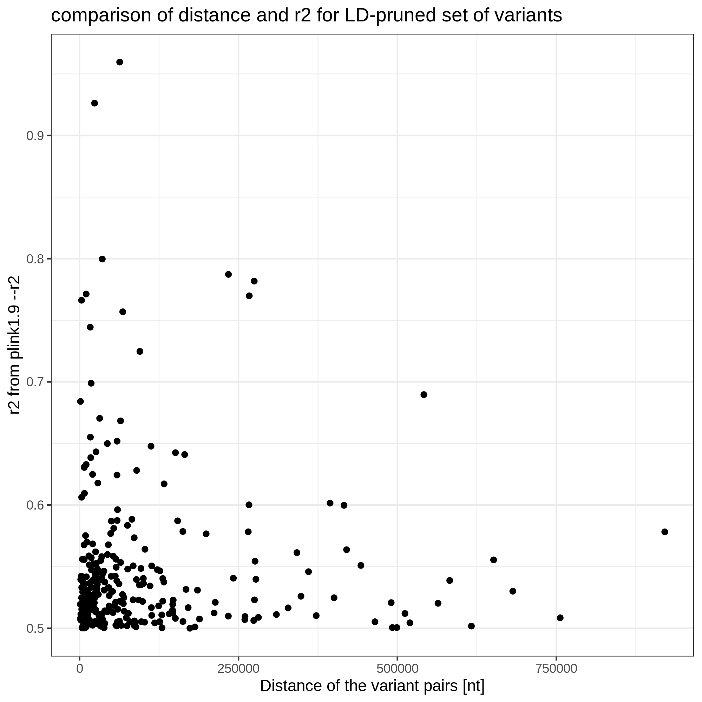

# LD computation on chrX

## Yosuke Tanigawa

## r2 values from two methods

We used the following commands to 1) compute the LD independent set of SNPs (`--indep-pairwise`) and 2) LD map (`--r2`).

```
$ plink2 --allow-extra-chr --indep-pairwise 1000kb 1 0.5
$ plink --allow-extra-chr --ld-window-kb 1000 --ld-window-r2 0.1 --r2 gz --ld-window 100000000
```

Note that I used v1.90b6.17 64-bit (28 Apr 2020) and v2.00a3LM AVX2 Intel (27 Jul 2020).

When I check the r2 values of the selected variants (the ones in `*.prune.in` file), I found many variant pairs that have r2>0.5 Some of them have r2>0.9. Here, we have a plot summarizing a comparison of the r2 value and the distance (plotted for the variant pairs with r2>.5).



This plot is generated in [`6c_LD_indep_check.ipynb`](6c_LD_indep_check.ipynb).

## chrX mode in plink1.9

```{bash}
--ld-xchr <code>   : Set chrX model for --indep[-pairwise], --r/--r2,
                     --flip-scan, and --show-tags.
                     1 (default) = males coded 0/1, females 0/1/2 (A1 dosage)
                     2 = males coded 0/2
                     3 = males coded 0/2, but females given double weighting
```

## Additional comments from Chris:

```
plink2 --indep-pairwise always uses "--ld-xchr 3".

plink 1.9 --indep-pairwise and --r2's default chrX behavior (--ld-xchr 1) is buggy for all practical purposes, because it has an asymmetric dependency on which allele is A1 and which allele is A2; it is only implemented the way it is for backward compatibility with plink 1.07.  I would use "--ld-xchr 2" or "--ld-xchr 3" with --indep-pairwise ~100% of the time when not explicitly trying to replicate an old plink 1.07 run.

(Unfortunately, --r2 + "--ld-xchr 3" is not implemented in plink 1.9, but it can be emulated by duplicating all the females and then running --r2 + "--ld-xchr 2".)
```

We will trust plink2 --indep-pairwise results for now, and try to mimic --r2 + "--ld-xchr 3" using the method you've provided.

Please ask Yosuke to search his email "PLINK2's --indep-pairwise for chrX" if you want to learn more about it.
