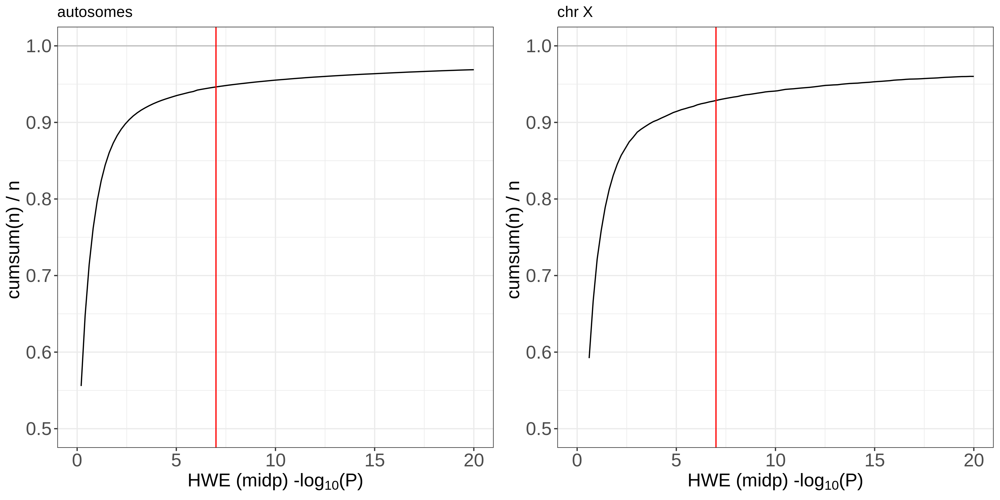
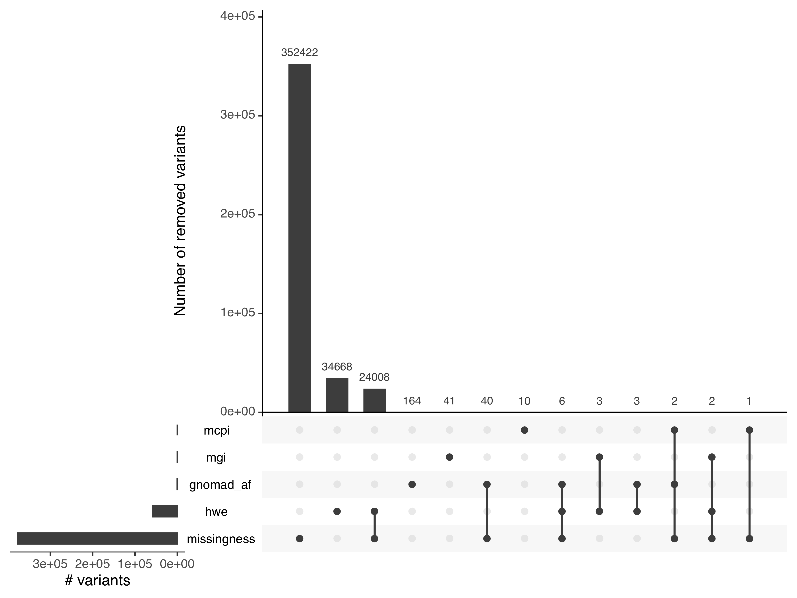

# variant annotation and variant QC for the array-combined dataset

### Yosuke Tanigawa, 2020/10/23

- We updated the variant annotation for the array-combined dataset. This includes the updated variant QC for non-autosomal chromosomes, the variant annotation from the latest version of VEP/Loftee (for both array and cnv dataset), and the results from the latest LD pruning analysis.
- We have the annotation table for the 1080968 variants in the pgen/pvar file (in the exactly same ordering as in the pvar file).
- The full annotation table has 160 columns. I prepared a file that has a subset of commonly used 28 columns.

## Data location

- `/oak/stanford/groups/mrivas/ukbb24983/array-combined/annotation/annotation_20201012/ukb24983_cal_hla_cnv.annot_20201023.tsv.gz`
- `/oak/stanford/groups/mrivas/ukbb24983/array-combined/annotation/annotation_20201012/ukb24983_cal_hla_cnv.annot_compact_20201023.tsv.gz`

The first file is the full variant annotation file. The second file has a subset of columns.

### Column descriptor

The first 27 columns are present in both files.

- `CHROM`: the chromosome
- `POS`: the position (see CNV_POS_s and CNV_POS_e as well for the CNVs)
- `ID`: the variant ID
- `REF`: the reference allele
- `ALT`: the alternate allele
- `FILTER`: variant QC filter
- `POS_total`: the "total" position in a linear coordinate, chr1-22, X, Y, and MT (useful for plotting)
- `Allele`: the allele used in VEP/Loftee plugin (typically, ALT allele, but it can be different)
- `Csq`: the aggregated consequence group
- `Consequence`: the consequence field from VEP/Loftee
- `SYMBOL`: the gene symbol
- `Gene`: the ensembl ID for the gene
- `ld_indep`: whether the variant is in the LD independent set (none of the CNVs or HLA alleles are included)
- `geno_data_source`: the genotype data source
- `array`: whether the variant is on UKBL array or UKBB array
- `CNV_POS_s`: the start position of CNV
- `CNV_POS_e`: the end position of CNV
- `UKB_white_british_MAF`: the minor allele frequency computed in white British unrelated individuals in UKB
- `hwe_p`: the HWE test p-value
- `mgi_notes`: notes from manual genome-browser inspection (from 2017 QC file)
- `f_miss`: the missigness
- `f_miss_UKBB`: the missingness in UKBB array
- `f_miss_UKBL`: the missingness in UKBL array
- `LoF`: Loss-of-function annotation (HC = High Confidence; LC = Low Confidence)
- `LoF_filter`: Reason for LoF not being HC
- `LoF_flags`: Possible warning flags for LoF
- `LoF_info`: Info used for LoF annotation

The next 133 columns (except `HGVSp`) are present only in the full table.
Among the 133 columns, 65 fields are from VEP/Loftee pipeline.

- `IMPACT`
- `Feature_type`
- `Feature`
- `BIOTYPE`
- `EXON`
- `INTRON`
- `HGVSc`
- `HGVSp`
- `cDNA_position`
- `CDS_position`
- `Protein_position`
- `Amino_acids`
- `Codons`
- `Existing_variation`
- `ALLELE_NUM`
- `DISTANCE`
- `STRAND`
- `FLAGS`
- `VARIANT_CLASS`
- `SYMBOL_SOURCE`
- `HGNC_ID`
- `CANONICAL`
- `MANE`
- `TSL`
- `APPRIS`
- `CCDS`
- `ENSP`
- `SWISSPROT`
- `TREMBL`
- `UNIPARC`
- `GENE_PHENO`
- `SIFT`
- `PolyPhen`
- `DOMAINS`
- `miRNA`
- `HGVS_OFFSET`
- `AF`
- `AFR_AF`
- `AMR_AF`
- `EAS_AF`
- `EUR_AF`
- `SAS_AF`
- `AA_AF`
- `EA_AF`
- `gnomAD_AF`
- `gnomAD_AFR_AF`
- `gnomAD_AMR_AF`
- `gnomAD_ASJ_AF`
- `gnomAD_EAS_AF`
- `gnomAD_FIN_AF`
- `gnomAD_NFE_AF`
- `gnomAD_OTH_AF`
- `gnomAD_SAS_AF`
- `MAX_AF`
- `MAX_AF_POPS`
- `CLIN_SIG`
- `SOMATIC`
- `PHENO`
- `PUBMED`
- `VAR_SYNONYMS`
- `MOTIF_NAME`
- `MOTIF_POS`
- `HIGH_INF_POS`
- `MOTIF_SCORE_CHANGE`
- `TRANSCRIPTION_FACTORS`

The next 68 columns are the same as the allele frequency computed across UKB populations (see the section below).

## Allele frequency across UKB populations in the array-combined dataset

`/oak/stanford/groups/mrivas/ukbb24983/array-combined/afreq_20201012/ukb24983_cal_hla_cnv.afreq_20201012.pvar.zst`

This (zstd-compressed) table file has 73 columns.

- The first 5 columns represent the location and the alleles of the variant as in the `pvar` file
  - `CHROM`, `POS`, `ID`, `REF`, and `ALT`
- Then, we have `array` column representing whether the variant is genotyped on BiLEVE array (`UKBL`), Axiom array (`UKBB`), or both (`both`). For CNVs and HLA allelotypes, we place `NA`.
- The next 64 columns are allele frequency and allele count computed for (1 + 7) populations in UK Biobank.
  - The (1 + 7) populations are:
    - The full 488k dataset of genotyped individuals
    - The 7 populations as defined in [`population_stratification_20200828`](03_filtering/population_stratification_20200828)
      - `white_british`, `non_british_white`, `african`, `s_asian`, `e_asian`, `related`, `others`
  - The 8 characteristics are:
    - `AF`: Alternate allele frequency, computed from `plink2 --freq` command
    - `OBS_CT`: the number of individuals with non-missing genotype values (`plink2 --geno-counts cols=nobs`)
    - `MISSING_CT`: the number of individuals with missing genotype values (`plink2 --geno-counts cols=missing`)
    - `HOM_REF_CT`: the number of individuals with homozygous reference allele (`plink2 --geno-counts cols=homref`)
    - `HET_REF_ALT_CTS`: the number of individuals with heterozygous allele (`plink2 --geno-counts cols=refalt`)
    - `TWO_ALT_GENO_CTS`: the number of individuals two alternate alleles (this dataset should represent biallelic variabts, so this should be the number of individuals with homozygous alternate allele) (`plink2 --geno-counts cols=altxy`)
    - `HAP_REF_CT`: the number of individuals with hemizygous reference allele (`plink2 --geno-counts cols=hapref`)
    - `HAP_ALT_CTS`: the number of individuals with hemizygous alternate allele (`plink2 --geno-counts cols=hapalt`)
- The next 3 columns represent the missingness
    - `f_miss`: missing rate
    - `f_miss_UKBL`: missing rate in UKBL array
    - `f_miss_UKBB`: missing rate in UKBB array

### Note

- we used the latest master sqc file to get the number of individuals genotyped on each array.
  - master sqc file `/oak/stanford/groups/mrivas/ukbb24983/sqc/population_stratification_w24983_20200828/ukb24983_master_sqc.20200828.phe`
  - {`UKBB`: 438427, `UKBL`: 49950}

### scripts

- [`1_afreq.sh`](1_afreq.sh)
- [`1_afreq-per-array.sh`](1_afreq-per-array.sh)
- [`2_combine_afreq_results.ipynb`](2_combine_afreq_results.ipynb)

## HWE

For HWE test in chrX, plink implements this relatively new procedure.

- J. Graffelman, B. S. Weir, Testing for Hardy–Weinberg equilibrium at biallelic genetic markers on the X chromosome. Heredity. 116, 558–568 (2016). https://doi.org/10.1038/hdy.2016.20

This method does NOT ignore the males when applying HWE test for chr X.

And here is the HWE p-value distribution (the red bar indicates our P-value cutoff of 1e-7):

### scripts

- [`3_hwe.sh`](3_hwe.sh)
- [`4_hwe_plot.ipynb`](4_hwe_plot.ipynb)

## Variant QC

Here is the summary of variant QC (across both autosomal and non-autosomal variants in the combined array dataset).

We have the following QC filters:

- `missingness`: missingness (1%, computed separately for UKBL/UKBB array if the variant is directly genotyped and present in only one array)
- `hwe`: HWE p-value (1e-7, we used the chrX model above)
- `mcpi`: manual cluster plot inspection (copied from variant QC file back in 2017)
- `gnomad_af`: maf comparison with gnomAD  (copied from variant QC file back in 2017)
- `mgi`: manual genome browser inspection???  (copied from variant QC file back in 2017)

The column descriptor for the previous variant QC file (basically the one from 2017): [`prev_annot_cols.md`](prev_annot_cols.md)

### data location

- `/oak/stanford/groups/mrivas/ukbb24983/array-combined/annotation/annotation_20201012/ukb24983_cal_hla_cnv.var_QC.tsv.gz`

### scripts

- [`5_variant_QC.ipynb`](5_variant_QC.ipynb)

## LD pruning

We apply LD pruning with `plink2 --indep-pairwise 1000kb 1 0.5`.
Note, we were originally using `plink2 --indep-pairwise 50 5 0.5`, but we swapped to distance-based LD window specification so that we are consistent with what we do in the LD map comptuation.

To prioritize the variants with severe predicted consequence, we applied LD pruning for each consequence group using the following procedure.

0. We focus on the QC-passed genotyped variants for this LD pruning analysis. In other words, we don't use CNVs and HLA allelotypes for the LD pruning analysis.
1. We apply LD pruning for the protein-truncating variants (PTVs). We check the pre-computed LD map with the same `r2` threshold and remove the variants that are in linkage with the selected variants.
2. We apply LD pruning for the ptotein-altering variants (PAVs) that are not in LD with previously selected variants (PTVs). Using the union of the selected PTVs and PAVs, we check the LD map and remove the variants that are in linkage.
3. Similarly, we apply LD pruning for the protein-coding variants (PCVs) that are no in LD with the previously selected PTVs or PAVs. Using the union of the selected PTVs, PAVs, and PCVs, we check the LD map and remove the variants in linkage.
4. Repeat the procedure for UTR-region variants, intronic variants, and the remaining variants.

Please also check [`LD-indep-chrX.md`](LD-indep-chrX.md).

### scripts

- [`6a_LD_indep_input.ipynb`](6a_LD_indep_input.ipynb)
- [`6b_LD_indep.sh`](6b_LD_indep.sh)
- [`6b_LD_indep_var_filter.R`](6b_LD_indep_var_filter.R)
- [`6c_LD_indep_check.ipynb`](6c_LD_indep_check.ipynb)
