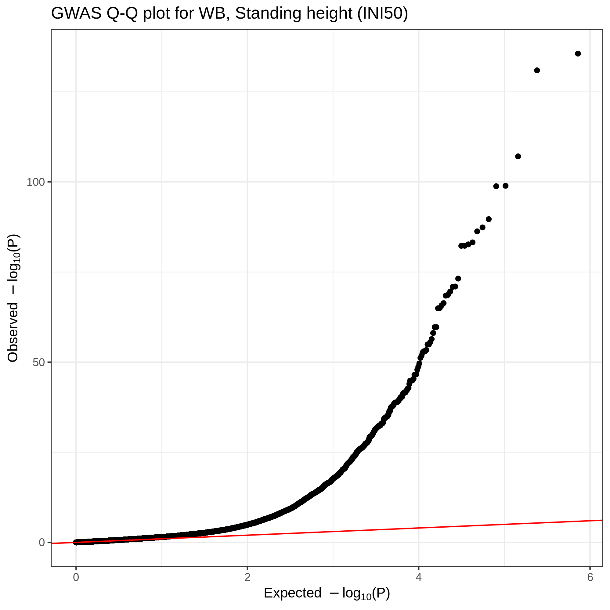

# Metal power analysis

Using standing height (INI50) as an example, we perform preliminary analysis for meta-analysis.

## Results summary

|            | WB | NBW | Afr | SA | EA | rel | others | relative power* | n_Metal |
|------------|----|-----|-----|----|----|-----|--------|-----------------|---------|
| WB         | x  |     |     |    |    |     |        | 1               | 337138  |
| 4pops      | x  | x   | x   | x  |    |     |        | 1.063           | 376425  |
| 5pops      | x  | x   | x   | x  | x  |     |        | 1.063           | 377579  |
| 5pops-noEA | x  | x   | x   | x  |    | x   |        | 1.177           | 421057  |
| 6pops      | x  | x   | x   | x  | x  | x   |        | 1.178           | 422211  |
| 6pops-noEA | x  | x   | x   | x  |    | x   | x      | 1.237           | 449608  |
| 7pops      | x  | x   | x   | x  | x  | x   | x      | 1.237           | 450762  |

- the relative power is computed by fitting a linear model `log10(Metal_P) ~ 0 + log10(WB_P)` on the significant (P < 5e-8 in WB or the meta-analyzed sumstats) LD-independent variants on the array. Please see [`2_compare_pval.ipynb`](2_compare_pval.ipynb) for the analysis notebook.


## input files

- [`INI50.lst`](INI50.lst): list of sumstats used in the analysis

Population labels are:

- WB: white British (337,138)
- NBW: non-British white (24,905)
- Afr: African (7,885)
- SA: South Asian (6,497)
- EA: East Asian (1,154)
- rel: semi-related individuals (44,632)
- others: the "others" population group (28,551)

## scripts

- [`1_run_metal.sh`](1_run_metal.sh): run Metal
- [`2_compare_pval.ipynb`](2_compare_pval.ipynb): the p-value vs p-value plots
- [`3_qq.ipynb`](3_qq.ipynb): QQ-plot for WB
  - [`3_qq_WB.png`](3_qq_WB.png)
- [`4_LDSC_munge.sh`](4_LDSC_munge.sh): apply LDSC munge (they also compute lambda GC)
- [`5_LDSC_rg.sh`](5_LDSC_rg.sh): LDSC rg

## run Metal

We applied Metal for different set of sumstats

- WB + NBW + Afr + SA
- WB + NBW + Afr + SA + EA
- WB + NBW + Afr + SA + EA + rel
- WB + NBW + Afr + SA + EA + rel + others
- WB + NBW + Afr + SA + rel
- WB + NBW + Afr + SA + rel + others

We plotted the p-value (WB) vs p-value (Metal)

## Q-Q plot

We generated Q-Q plot.




## Lambda GC from LDSC

We applied LDSC munge. This process also computes lambda GC for each sumstats.

```{bash}
LDSC_INI50_Afr.log:Lambda GC = 1.043
LDSC_INI50_EA.log:Lambda GC = 0.986
LDSC_INI50_NBW.log:Lambda GC = 1.118
LDSC_INI50_others.log:Lambda GC = 1.116
LDSC_INI50_rel.log:Lambda GC = 1.179
LDSC_INI50_SA.log:Lambda GC = 1.053
LDSC_INI50_WB.log:Lambda GC = 1.885
```

## LDSC rg

We computed the genetic correlation between WB and other populations.

| p1       | p2           | rg     | se     | z       | p         | h2_obs | h2_obs_se | h2_int | h2_int_se | gcov_int | gcov_int_se |
|----------|--------------|--------|--------|---------|-----------|--------|-----------|--------|-----------|----------|-------------|
| INI50_WB | INI50_NBW    | 0.9824 | 0.0433 | 22.6867 | 6.07E-114 | 0.4647 | 0.0453    | 1.0154 | 0.0076    | 0.039    | 0.0086      |
| INI50_WB | INI50_Afr    | 0.352  | 0.0954 | 3.6891  | 0.0002    | 0.1941 | 0.0861    | 1.0284 | 0.0066    | 0.0102   | 0.0071      |
| INI50_WB | INI50_SA     | 0.7237 | 0.0777 | 9.3192  | 1.17E-20  | 0.3825 | 0.0768    | 1.0164 | 0.0053    | -0.01    | 0.0064      |
| INI50_WB | INI50_EA     | 0.3518 | 0.1755 | 2.0049  | 0.045     | 0.4907 | 0.4564    | 0.9891 | 0.0065    | 0.0077   | 0.007       |
| INI50_WB | INI50_rel    | 0.9956 | 0.026  | 38.2888 | 0         | 0.4546 | 0.0333    | 1.0252 | 0.0082    | 0.0722   | 0.0096      |
| INI50_WB | INI50_others | 0.9647 | 0.0397 | 24.3272 | 1.01E-130 | 0.4016 | 0.0339    | 1.0152 | 0.0068    | 0.0255   | 0.0084      |
